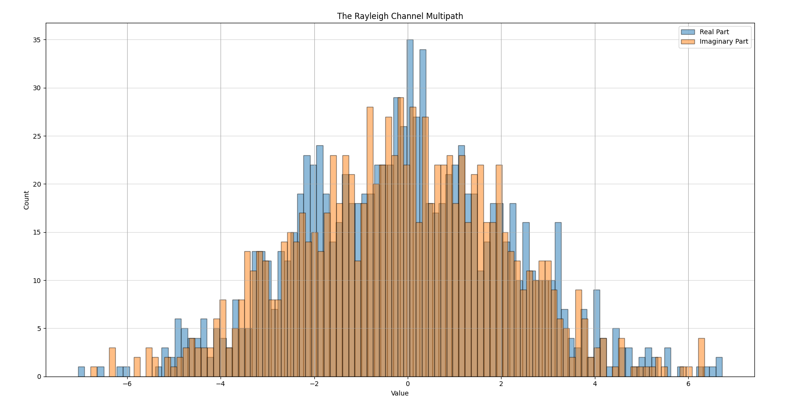

# Assignment

1. Repeat the SISO case (Tx, channel, noise addition, Rx) and produce the SER plots in the previous slide (Rayleigh and AWGN)

2. Consider a channel of the form
   
$$h(\tau) = \sum_{i=1}^{10} 1 \cdot \delta(\tau - \tau_i)$$

where $\tau_i$ are uniformly distributed $[50m, 100m] \cdot \frac{1}{3 \cdot 10^8 m/\sec}$

Show the distribution of the real and imaginary part of
$$H(f = 2.5GHz)$$

Use the built-in functions randsrc to create QPSK signals easily
rand (for uniform RV) and hist (for plotting historgrams)

# Results
## 1. Simulation Explanation (a-siso.py)

This script simulates a Single-Input Single-Output (SISO) communication system using QPSK modulation. 
It compares the performance of the system under two different channel conditions: Additive White Gaussian Noise (AWGN) 
and Rayleigh Fading.

### Process
1.  **Symbol Generation**: Random integers (0-3) are generated and mapped to QPSK constellation points on the complex plane (phases: 45°, 135°, 225°, 315°).
2.  **Channel Simulation**:
    *   **AWGN**: Adds complex Gaussian noise to the signal.
    *   **Rayleigh**: Multiplies the signal by a complex Gaussian channel coefficient (fading) and adds noise.
3.  **Equalization**: Reverses the channel effect to estimate the transmitted symbol.
4.  **Detection**: Uses Maximum Likelihood (ML) detection to map the estimated symbols back to the nearest constellation point.
5.  **Error Calculation**: Compares transmitted and detected symbols to calculate the Symbol Error Rate (SER) for various Signal-to-Noise Ratio (SNR) levels.

### Output
The script generated plot shows the following:
*   **Blue Dashed Line (SISO AWGN)**: Shows the error rate in a pure noise environment. It drops rapidly as SNR increases (waterfall curve).
*   **Red Solid Line (SISO Rayleigh)**: Shows the error rate in a fading environment. It drops much slower than the 
AWGN curve, demonstrating the detrimental effect of multipath fading on signal reliability.

## 2. Simulation Explanation (b-mp.py)

This script simulates the statistical properties of a multipath fading channel, specifically focusing on the distribution 
of the real and imaginary parts of the channel response at a specific frequency.

### Process
1.  **Multipath Model**: The channel is modeled as a sum of 10 distinct paths ($N=10$).
2.  **Random Delays**: For each realization, 10 random delays ($\tau_i$) are generated uniformly between 50m and 100m.
3.  **Frequency Response**: The channel response at a carrier frequency $f_c = 2.5 \text{ GHz}$ is calculated as the sum of complex exponentials.
4.  **Visualization**: The real and imaginary parts of the resulting $H(f_c)$ values are plotted as histograms.

### Output
The script generated histogram shows the following:
*   **Real Part (Blue)**: Shows the distribution of the real component of the channel response.
*   **Imaginary Part (Orange)**: Shows the distribution of the imaginary component.

**Central Limit Theorem (CLT)**: The channel response is the sum of many independent random variables. According to the 
Central Limit Theorem, the sum of independent random variables tends toward a Gaussian (Normal) distribution.

**Rayleigh Fading**: Since the real and imaginary parts are independent and Gaussian distributed with zero mean and equal 
variance, the magnitude of the channel response follows a **Rayleigh distribution**. This confirms that a multipath channel 
with sufficient paths behaves like a Rayleigh fading channel.

