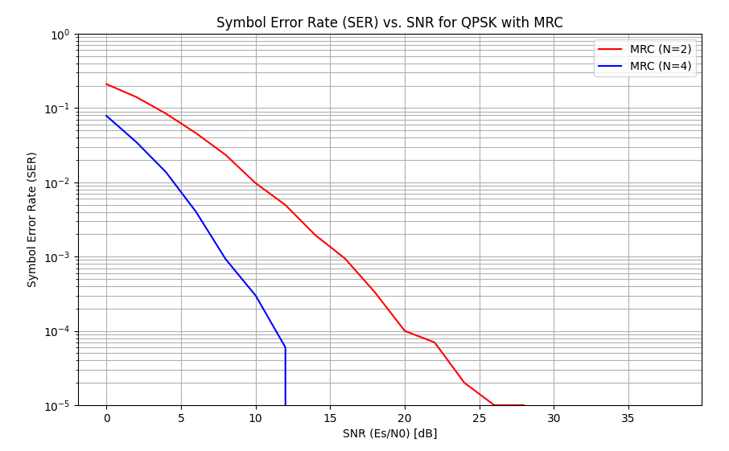
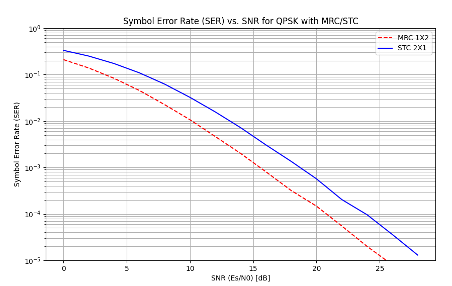

1. Repeat the MRC case (Tx, channel, Rx) and reproduce the SER curve for $N=2,4$ Rx antennas

2. Repeat the STC case (Tx, channel, Rx) and reproduce the SER curve for 2 Tx and 1 Rx antennas

Compare with MRC 2

# Results

## 1. Simulation Explanation (a-mrc.py)

This script simulates a Multiple-Input Multiple-Output (MIMO) communication system using **Maximal Ratio Combining (MRC)** 
at the receiver. It evaluates the performance improvement gained by using multiple receive antennas ($N=2$ and $N=4$) 
compared to a single antenna system.

### Process
1.  **Symbol Generation**: QPSK symbols are generated (random integers 0-3 mapped to complex constellation points).
2.  **MIMO Channel**: The signal is transmitted from a single antenna and received by $N$ antennas (simulated for $N=2$ and $N=4$).
    Each path experiences independent Rayleigh fading ($h$) and Additive White Gaussian Noise (AWGN).
3.  **Maximal Ratio Combining (MRC)**: The receiver combines the signals from all $N$ antennas and weights each received 
signal by the conjugate of its channel coefficient ($h^*$). This aligns the phases of the signals so they add up 
constructively (coherently) and weights stronger paths more heavily.
4.  **Detection**: ML detection is performed on the combined signal to recover the transmitted symbols.
5.  **Performance Evaluation**: The Symbol Error Rate (SER) is calculated over a range of SNR values.

### Output
The generated script plot shows the following:

**Diversity Gain**: With multiple antennas, the probability that *all* paths are in a deep fade simultaneously is very 
low. MRC effectively averages out the fading, making the effective channel much more stable. The slope of the SER curve 
becomes steeper as $N$ increases.

**Array Gain**: By coherently combining signals, the signal power increases by a factor of $N$ (on average), while noise 
power increases only by $N$ (incoherent sum) or stays constant relative to the signal depending on normalization.

**Comparison**: The $N=4$ curve is significantly to the left (better performance) and steeper than the $N=2$ curve, 
illustrating the powerful benefits of receive diversity.

## 2. Simulation Explanation (b-stc.py)

This script simulates a Space-Time Coding (STC) system, specifically the **Alamouti Scheme** (2 Transmit, 1 Receive antenna), 
and compares it with a 1 Transmit, 2 Receive antenna MRC system.

### Process
1.  **Alamouti Encoding (STC)**: The symbols are taken in pairs $(s_0, s_1)$ where in time slot 1, antenna 1 sends $s_0$ 
and antenna 2 sends $s_1$. In time slot 2, antenna 1 sends $-s_1^*$ and antenna 2 sends $s_0^*$.
2.  **Channel**: The channel is assumed constant over the two time slots and independent Rayleigh fading coefficients $h_0$ and $h_1$ for the two transmit antennas.
3.  **Decoding**: The receiver constructs an effective channel matrix $H$ from the estimated channel coefficients and 
due to the orthogonal structure of the Alamouti code, the matrix inversion perfectly separates the two symbols without 
noise enhancement.

### Output
The script generated plot shows that:

**Diversity Order**: Both systems achieve a diversity order of 2 (slope of the curve). This is because both systems 
provide 2 independent signal paths for the information to reach the receiver.

**Array Gain Difference**: The MRC curve is shifted to the left of the STC curve by exactly **3 dB** (factor of 2). 
This 3 dB difference represents the **receive array gain** (collecting more energy) which STC lacks.

