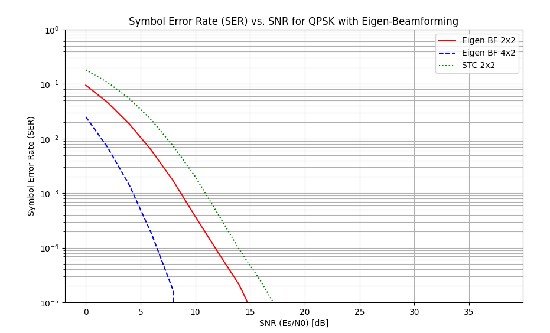

# Assignment
Repeat the Eigen BF case for 2Rx X 2Tx and 2Rx X 4Tx

Compare with the STC 2X2

---
Use the built-in function [V,D]=eig(X) or [U,D,V]=svd(X)

# Results

The simulation compares the Symbol Error Rate (SER) performance of Eigen Beamforming (BF) and Space-Time Coding (STC).

**Eigen Beamforming:** Eigen Beamforming utilizes Channel State Information (CSI) at the transmitter. 
By performing Singular Value Decomposition (SVD) on the channel matrix H, the transmitter selects the precoding vector 
corresponding to the largest singular value (dominant mode). This technique achieves both **diversity gain** and 
**array gain** (SNR improvement due to coherent combining).

*   **2x2 BF vs STC 2x2:** The 2x2 Eigen BF outperforms the 2x2 STC. While both schemes offer diversity, Eigen BF has 
the advantage of array gain because it knows the channel and directs power efficiently. STC does not use CSI at the 
transmitter and thus lacks this array gain.
*   **4x2 BF:** Increasing the number of transmit antennas to 4 further improves performance compared to 2x2 BF. 
This is due to the increased diversity order and higher array gain provided by the additional antennas.
*  **Space-Time Coding (STC 2x2):** The STC scheme (Alamouti) provides full transmit diversity without requiring CSI 
at the transmitter. However, since it radiates energy in all directions (isotropically) rather than focusing it towards 
the receiver, it performs worse than the beamforming schemes which exploit CSI.

