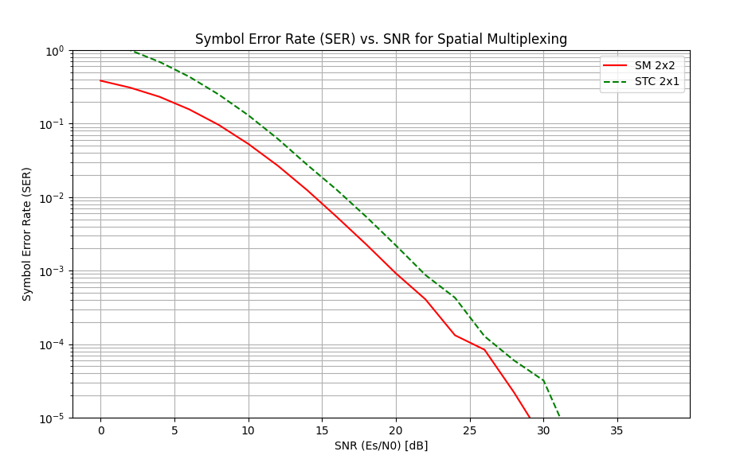

# Assignment 
Produce the SER curve for 2X2 SM with ML detection

Compare with STC 2X1

## Results

The simulation compares the Symbol Error Rate (SER) performance of Spatial Multiplexing (SM) and Space-Time Coding (STC).

**Spatial Multiplexing (SM 2x2):** In the 2x2 Spatial Multiplexing scheme, independent data streams are transmitted 
simultaneously from different antennas. This increases the data rate (multiplexing gain). The receiver uses Maximum 
Likelihood (ML) detection to jointly estimate the transmitted symbols.

**Space-Time Coding (STC 2x1):** The STC scheme (Alamouti) is used here with 2 transmit antennas and 1 receive antenna.
    
The STC 2x1 outperforms SM 2x2 in terms of SER (reliability) due to higher diversity gain (slope of 2 vs 1) and provides 
double the data rate of STC 2x1. There is a trade-off between diversity (reliability) and multiplexing (rate). STC 
maximizes diversity, while SM maximizes rate.

