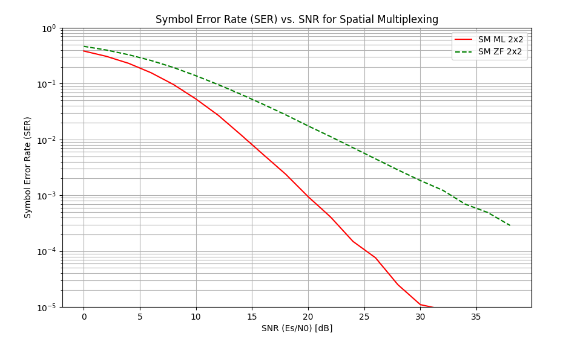
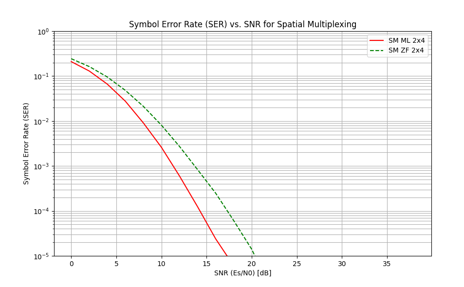

# Assignment

Produce the SER curve for 2X2, 4X2 SM with ML and ZF
detection

# Results

The simulation compares the Symbol Error Rate (SER) performance of Spatial Multiplexing (SM) using two different 
detection schemes: Maximum Likelihood (ML) and Zero Forcing (ZF), for both 2x2 and 4x2 antenna configurations.

**Detection Schemes:**
**Maximum Likelihood (ML):** ML detection searches for the transmitted symbol vector that minimizes the Euclidean 
distance to the received signal. It is the optimal detector in terms of minimizing error probability but has high 
computational complexity (exponential in the number of antennas and constellation size).

**Zero Forcing (ZF):** ZF detection applies a linear filter to separate the transmitted streams. It is 
computationally simple but suffers from noise enhancement, especially when the channel matrix is ill-conditioned.

**Performance Comparison:**
**ML vs. ZF:** As expected, ML detection significantly outperforms ZF detection for both 2x2 and 4x2 configurations. 
ZF's performance is degraded by noise enhancement.

**Antenna Configuration (2x2 vs 4x2):** Increasing the number of receive antennas from 2 to 4 (while keeping 2 transmit 
streams) further improves performance for both detectors. This is due to the increased receive diversity gain (increases from 1 to 3).

