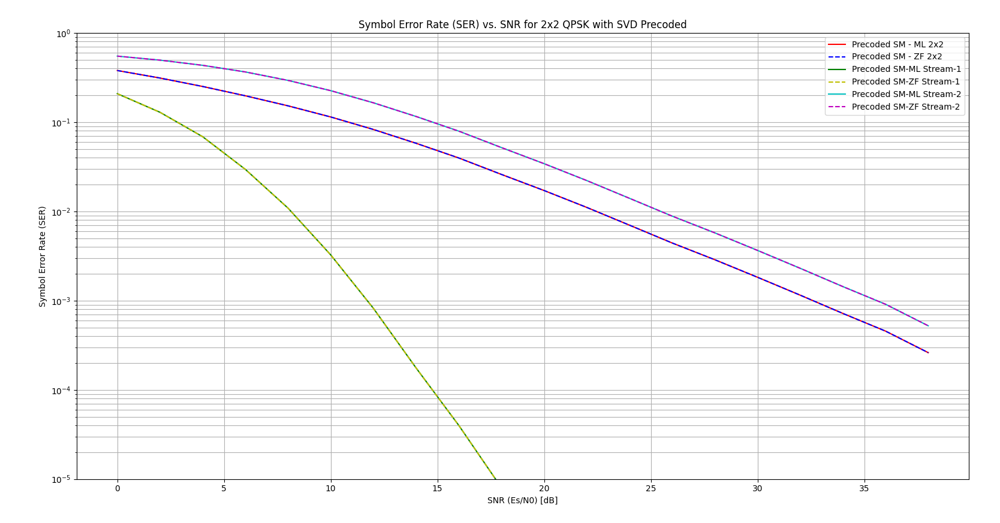
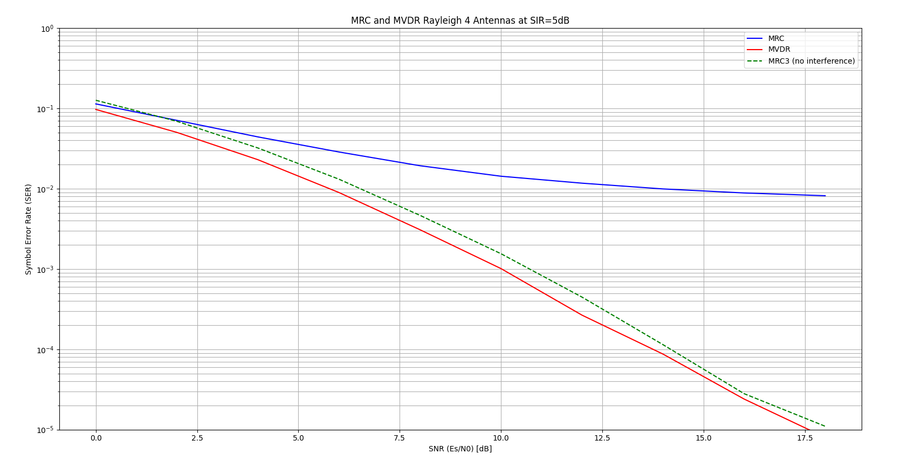

# Assignment
1. In a 2x2 system, employ SVD precoding $x = \frac{1}{\sqrt{2}}\mathbf{Vs}$.
   * Decode with ML and ZF and show identical results.
   * Plot the SER curve of each stream separately.

2. Consider a receiver with 4 antennas and the model:

$\mathbf{y} = \mathbf{h}s + \sqrt{P_g}\mathbf{g}r + \rho\mathbf{n}$

where $\mathbf{h}$, $\mathbf{g}$ and $r$ are $CN(0,1)$ iid and $P_g = 0.3162$ (5dB SIR).
   * Decode with MRC.
   * Decode with MVDR.
   * Compare the MVDR with MRC without interference.

# Results

## Part 1: SVD Precoded Spatial Multiplexing (2x2)

In this part, we employ SVD precoding at the transmitter. The channel matrix is decomposed as 
$\mathbf{H} = \mathbf{U}\mathbf{\Sigma}\mathbf{V}^H$. The effective channel becomes 
$\mathbf{H}_{eff} = \mathbf{H}\mathbf{V} = \mathbf{U}\mathbf{\Sigma}$. Since $\mathbf{U}$ is unitary and 
$\mathbf{\Sigma}$ is diagonal, the MIMO channel is effectively diagonalized into parallel SISO channels with gains 
corresponding to the singular values $\sigma_i$.

*   **ML vs. ZF:** Because the effective channel is diagonal (orthogonal streams), Zero Forcing (ZF) and Maximum 
Likelihood (ML) detection yield identical results. There is no inter-stream interference to mitigate, so the optimal ML 
detector simplifies to the per-stream detection performed by ZF (after equalizing the diagonal gains).
*   **Stream Performance:** The performance of each stream depends on its corresponding singular value. The first stream 
corresponds to the largest singular value ($\sigma_1$) and thus has a higher SNR and lower SER than the second stream ($\sigma_2$).
*   **Overall Performance:** The overall SER is an average of the two streams.

## Part 2: Null Steering / MVDR (4 Rx Antennas)

This part investigates the performance of a receiver with 4 antennas in the presence of a strong interferer.

*   **MRC (Maximal Ratio Combining):** MRC maximizes the SNR of the desired signal but ignores the interference. In the 
presence of a strong interferer ($P_g = 0.3162$, SIR = 5dB), MRC performs poorly because it treats the interference as 
noise. The error floor is determined by the SIR.
*   **MVDR (Minimum Variance Distortionless Response):** MVDR (also known as Capon beamforming) minimizes the total 
output power while maintaining unity gain towards the desired signal. This effectively places a null in the direction of 
the interferer. As a result, MVDR significantly outperforms MRC in the interference-limited regime.
*   **Comparison with MRC (no interference):** The performance of MVDR with interference is compared to MRC with 3 antennas 
without interference. Since MVDR uses one degree of freedom to null the interferer, it effectively has $N_R - 1 = 3$ 
* degrees of freedom left for diversity/gain. Thus, its performance closely matches that of an interference-free MRC 
receiver with 3 antennas.

