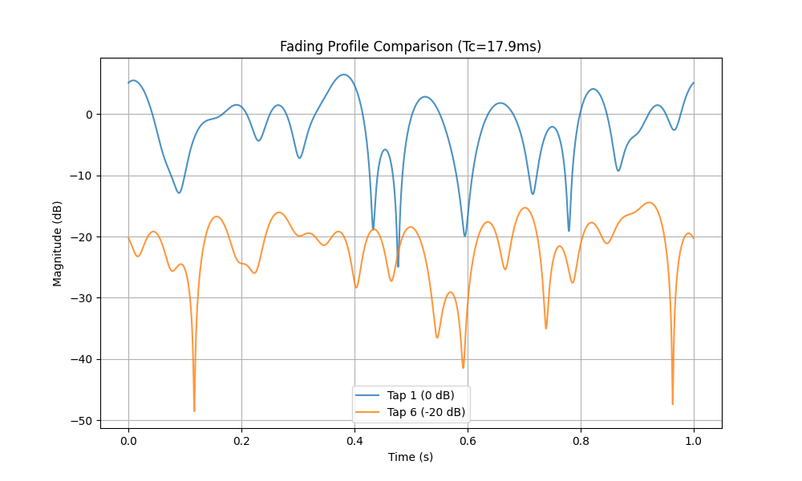

# Assignment

1. **Simulate the Channel A** in the table below:
* Compute the response at some $t_0$ 
* Compare the response at $t_0 + \Delta_1$, where $\Delta_1$ << $T_c$ (Short time, high correlation)
* Compare the response at $t_0 + \Delta_2$, where $\Delta_2$ >> $T_c$  (Long time, low correlation)

**Channel A Parameters:**

| Tap | Relative Delay (ns) | Average Power (dB) | Doppler Spectrum |
| --- | --- | --- | --- |
| 1 | 0 | 0.0 | Classic |
| 2 | 310 | -1.0 | Classic |
| 3 | 710 | -9.0 | Classic |
| 4 | 1090 | -10.0 | Classic |
| 5 | 1730 | -15.0 | Classic |
| 6 | 2510 | -20.0 | Classic |

# Results

The simulation generates a time-varying frequency-selective fading channel based on the "Channel A" specifications. 
The channel consists of 6 taps with different delays and average powers. The time variation is modeled using Jakes' 
Doppler spectrum.

1.  **Coherence Time ($T_c$):**
    The coherence time is calculated as $T_c \approx \frac{9}{16\pi f_{max}}$. For a maximum Doppler shift $f_{max} = 10$ Hz, $T_c \approx 17.9$ ms. This represents the duration over which the channel impulse response is considered relatively stable (highly correlated).

2.  **Correlation Analysis:**
    *   **Short Time Interval ($\Delta_1 \ll T_c$):** We chose $\Delta_1 = 0.01 T_c$. The correlation between the 
    channel response at $t_0$ and $t_0 + \Delta_1$ is very high (close to 1.0). This confirms that the channel changes 
    very slowly within the coherence time.
    *   **Long Time Interval ($\Delta_2 \gg T_c$):** We chose $\Delta_2 = 5.0 T_c$. The correlation between the channel 
    response at $t_0$ and $t_0 + \Delta_2$ is significantly lower (close to 0.4). This indicates that the channel has 
    changed considerably and the two samples are effectively uncorrelated.

3.  **Fading Profile:**
    The plot shows the magnitude (in dB) of the first tap (0 dB) and the last tap (-20 dB) over time.
    *   Both taps exhibit Rayleigh fading characteristics (deep fades).
    *   The variations are slow, consistent with the low Doppler frequency (10 Hz).
    *   The average power difference between the two taps is clearly visible (approx. 20 dB).

