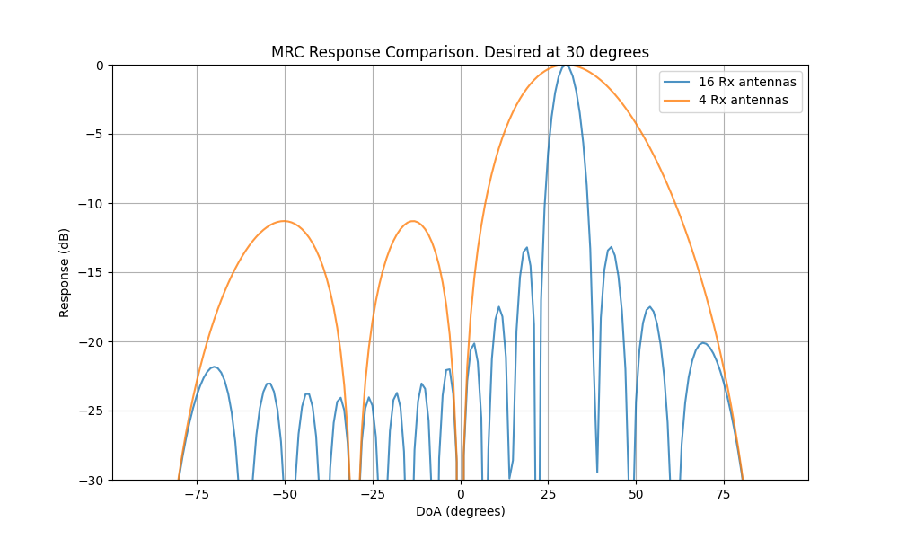

# Assignment

Apply the MRC for a desired DoA to all DoAs in the range $-90^0:90^0$ and compute the post MRC response
   * Consider 4 Rx antennas
   * Consider 16 Rx antennas
   * Consider different desired DoAs

# Results

The simulation computes the spatial response of a Maximal Ratio Combining (MRC) beamformer (which is equivalent to a 
matched filter or a phased array steered to a specific direction) for a desired Direction of Arrival (DoA).

**Beamforming Principle:** The receiver applies a weight vector $\mathbf{w}$ that matches the steering vector 
$\mathbf{a}(\theta_{desired})$ of the desired signal. The response to a signal arriving from angle $\phi$ is given 
by $|\mathbf{w}^H \mathbf{a}(\phi)|$. This effectively steers the main lobe of the antenna array towards $\theta_{desired}$.

**Effect of Number of Antennas ($N$):** The plot compares the response for $N=4$ and $N=16$ antennas, with the desired 
DoA set to $30^\circ$. 
*   **Main Lobe Width:** As the number of antennas increases from 4 to 16, the main lobe becomes significantly narrower. 
This indicates higher spatial resolution and better ability to reject interference from nearby angles.
*   **Sidelobes:** With more antennas, the sidelobe structure becomes more complex, but the main beam is much sharper.

**Direction of Arrival:** The peak of the response aligns perfectly with the desired DoA ($30^\circ$), confirming that 
the beamformer is correctly steering the array.

