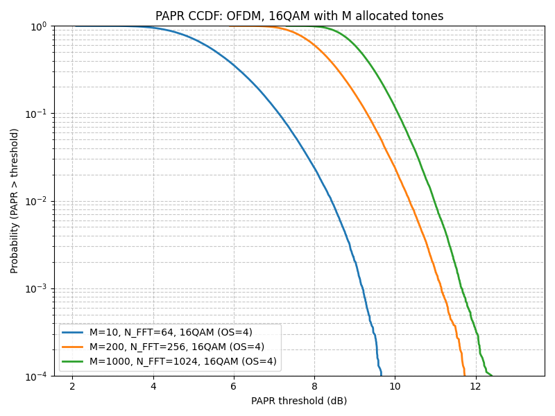
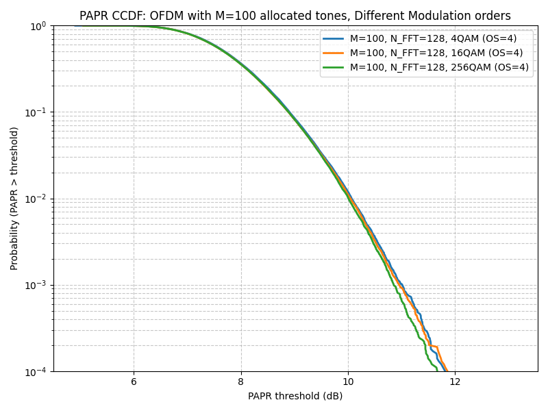

# Assignment

### OFDM PAPR
a) Build an OFDM signal with    
 * Flexible modulation (QPSK – 256QAM)  
 * Flexible N_FFT  
 * Flexible Oversampling (through longer IFFT)  

b) Compute the PAPR of each OFDM symbol  
c) Plot the CCDF of the PAPR  
d) Repeat for N_FFT=64, 256, 1024  
e) Repeat for QPSK, 16QAM, 256QAM

# Results

The simulation analyzes the Peak-to-Average Power Ratio (PAPR) of OFDM signals using the Complementary Cumulative 
Distribution Function (CCDF). The CCDF denotes the probability that the PAPR of an OFDM symbol exceeds a certain 
threshold $P(PAPR > PAPR_0)$.

**Effect of Modulation Order (QPSK, 16QAM, 256QAM):**
*   The results show that the PAPR distribution is largely independent of the constellation size (modulation order). 
The curves for QPSK, 16QAM, and 256QAM are very close to each other. This is because the PAPR in OFDM is dominated by 
the summation of many random subcarriers (Central Limit Theorem), regardless of the specific modulation on each subcarrier.

**Effect of FFT Size ($N_{FFT}$):**
*   As $N_{FFT}$ increases (from 64 to 1024), the maximum possible PAPR increases. The CCDF curves shift to the right, 
indicating a higher probability of observing large PAPR values.
*   With more subcarriers, there is a higher chance that they will constructively interfere to produce a large peak.

**Oversampling:**
*   Oversampling (OS=4) is used to capture the true analog peaks of the signal which might occur between the discrete 
samples. Without oversampling, the PAPR would be underestimated.

**Effect of FFT Size:**

**Effect of Modulation Order:**

